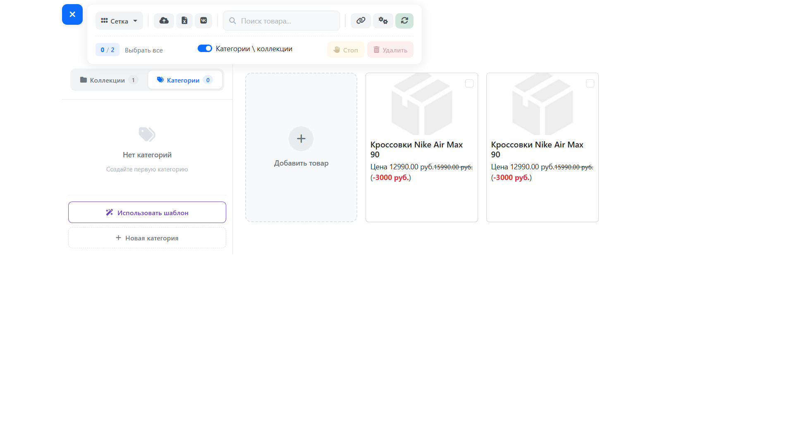
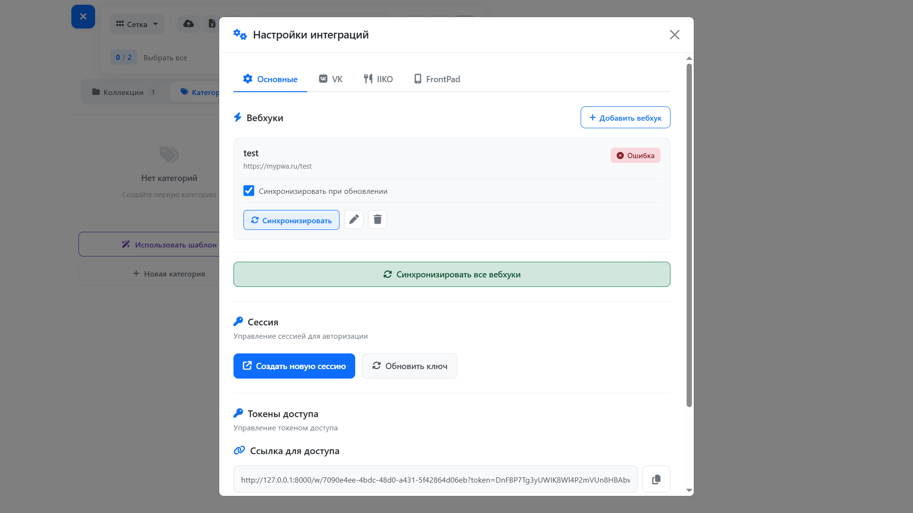
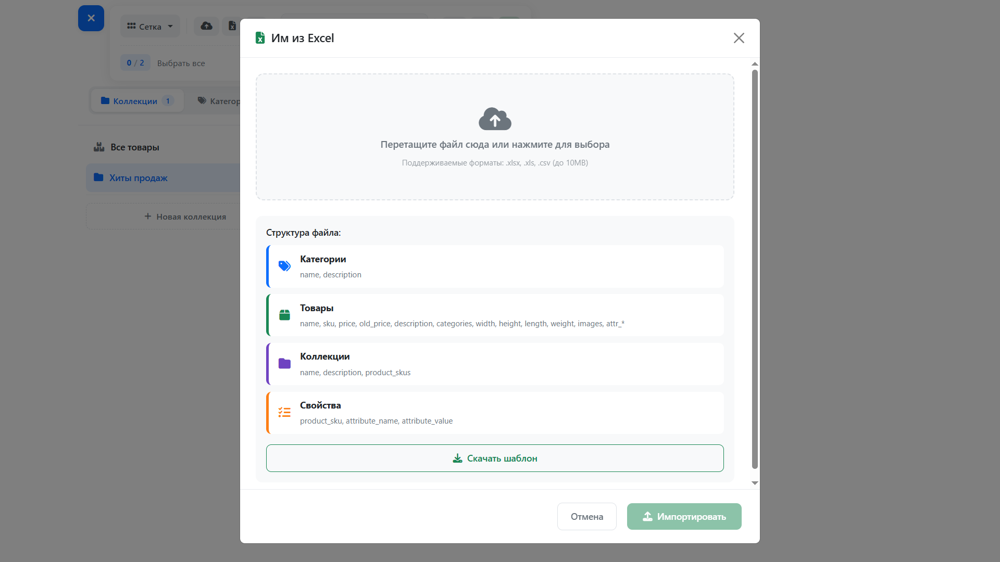
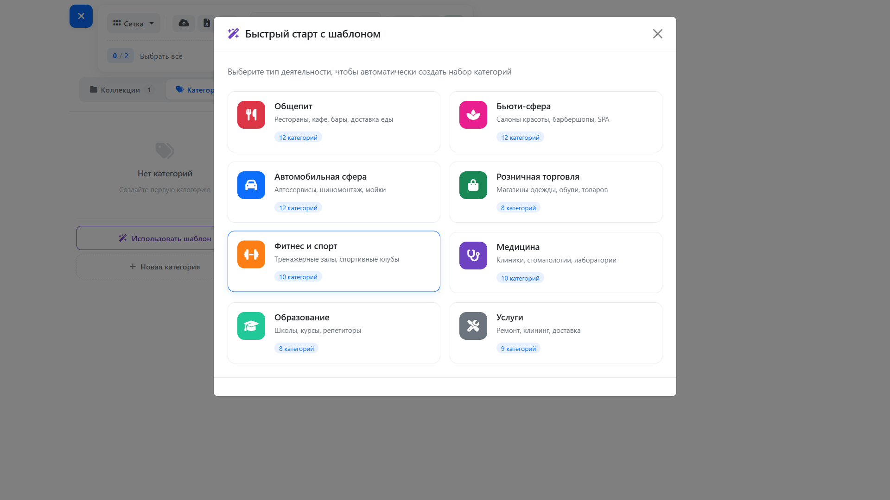

# 🛍️ Products Platform

> Универсальная платформа для подготовки и управления товарами с интеграциями, вебхуками и гибкой системой импорта/экспорта.


---

## 📖 О проекте

**Products Platform** — это универсальная платформа для подготовки товаров, которая позволяет создавать единое пространство для управления товарами, категориями и коллекциями с возможностью интеграции с внешними системами через вебхуки.

Платформа подходит для любого типа бизнеса: от общепита и бьюти-сферы до розничной торговли и автомобильных услуг.

### 🎯 Основные возможности

- 📦 **Управление товарами** — создание, редактирование, массовое удаление
- 🏷️ **Категории** — иерархическая структура, пресеты по типам бизнеса
- 📁 **Коллекции** — группировка товаров с сортировкой
- 📊 **Импорт/Экспорт Excel** — работа с несколькими вкладками одновременно
- 🔗 **Интеграция с VK** — импорт товаров из групп ВКонтакте
- ⚡ **Вебхуки** — автоматическая синхронизация с внешними системами
- 🔐 **Авторизация через shareable links** — безопасный доступ по ссылке
- 🎨 **Современный UI** — адаптивный интерфейс с анимациями
- 📱 **PWA** — установка как приложение на рабочий стол

---

## 📸 Скриншоты


<div align="center">
  
</div>

<div align="center">
  
</div>

<div align="center">
  
</div>

<div align="center">
  
</div>


---

## ✨ Возможности

### 📦 Товары
- ✅ Создание и редактирование товаров с валидацией
- ✅ Множественные изображения с drag-and-drop
- ✅ Атрибуты и характеристики (бренд, цвет, материал и т.д.)
- ✅ Габариты и вес
- ✅ Привязка к нескольким категориям
- ✅ Массовое удаление с подтверждением
- ✅ Поиск и фильтрация
- ✅ Режимы отображения: сетка, таблица, по категориям

### 🏷️ Категории
- ✅ Иерархическая структура (parent/child)
- ✅ Пресеты для быстрого старта (8 типов бизнеса)
- ✅ Автоматическое создание из товаров
- ✅ Счётчик товаров в каждой категории

### 📁 Коллекции
- ✅ Группировка товаров в подборки
- ✅ Сортировка товаров внутри коллекции
- ✅ Привязка по SKU
- ✅ Управление через sidebar

### 📊 Импорт/Экспорт Excel
- ✅ Импорт из `.xlsx`, `.xls`, `.csv`
- ✅ 4 вкладки: Категории, Товары, Коллекции, Свойства
- ✅ Автоматическое создание категорий из импорта
- ✅ Динамические атрибуты через колонки `attr_*`
- ✅ Экспорт всех данных с красивым оформлением
- ✅ Шаблон для скачивания

### 🔗 Интеграция с VK
- ✅ OAuth 2.0 авторизация
- ✅ Импорт товаров из нескольких групп
- ✅ Синхронизация альбомов как категорий
- ✅ Автоматическое обновление цен и наличия
- ✅ Обработка изображений

### ⚡ Вебхуки
- ✅ Добавление неограниченного количества вебхуков
- ✅ Авто-синхронизация при обновлении товаров
- ✅ Ручная синхронизация одного или всех вебхуков
- ✅ Отслеживание статуса и времени последней синхронизации
- ✅ Подробное логирование

### 🔐 Безопасность
- ✅ Авторизация через shareable links
- ✅ Токены доступа с возможностью перегенерации
- ✅ Поддержка сессии через cookie/localStorage
- ✅ Middleware для проверки доступа

---

## 🛠️ Стек технологий

### Backend
- **PHP 8.1+**
- **Laravel 10.x** — основной фреймворк
- **Laravel Sanctum** — авторизация
- **Maatwebsite Excel** — работа с Excel
- **VK PHP SDK** — интеграция с VK API
- **MySQL** — база данных

### Frontend
- **Vue 3** — реактивный UI
- **Pinia** — управление состоянием
- **Axios** — HTTP клиент
- **Bootstrap 5** — базовые стили
- **Font Awesome 6** — иконки
- **Vue Router** — маршрутизация

---

## 📋 Требования

- PHP >= 8.1
- Composer
- Node.js >= 16.x
- NPM или Yarn
- MySQL >= 8.0
- Laravel Herd / OpenServer / Docker

---

## 🚀 Установка

### 1. Клонирование репозитория

```bash
git clone https://github.com/your-username/products-platform.git
cd products-platform
```

### 2. Backend

# Установка зависимостей
```bash
composer install
```
# Копирование окружения
```bash
cp .env.example .env
```
# Генерация ключа приложения
```bash
php artisan key:generate
```
# Создание базы данных
```bash
php artisan migrate
```
# Создание символической ссылки для storage
```bash
php artisan storage:link
```

### 3. Frontend
# Установка зависимостей
```bash
npm install
```
# Сборка для разработки
```bash
npm run dev
```
# Или сборка для продакшена
```bash
npm run build
```

### 4. Настройка cron (для очередей)

# Добавьте в crontab
```
* * * * * cd /path-to-your-project && php artisan schedule:run >> /dev/null 2>&1
```

## ⚙️ Конфигурация

### Переменные окружения (.env)
```env
# Приложение
APP_NAME="Products Platform"
APP_URL=https://your-domain.com

# База данных
DB_CONNECTION=mysql
DB_HOST=127.0.0.1
DB_PORT=3306
DB_DATABASE=products_platform
DB_USERNAME=root
DB_PASSWORD=

# VK API
VK_CLIENT_ID=your_vk_app_id
VK_CLIENT_SECRET=your_vk_app_secret

# Очереди (опционально)
QUEUE_CONNECTION=sync  # или redis, database
```

### Конфигурация VK приложения
1. Создайте приложение на https://dev.vk.com/
2. Тип приложения: Веб-сайт
3. Укажите Redirect URI: https://your-domain.com/workspace/vk-callback
4. Включите права доступа: Товары (Market)

## 📁 Структура проекта

```
products-platform/
├── app/
│   ├── Http/
│   │   ├── Controllers/
│   │   │   └── Api/
│   │   │       ├── ProductController.php
│   │   │       ├── CategoryController.php
│   │   │       ├── CollectionController.php
│   │   │       ├── WebhookController.php
│   │   │       ├── ImportController.php
│   │   │       ├── VKProductController.php
│   │   │       └── CategoryPresetController.php
│   │   └── Middleware/
│   │       └── WorkspaceAuth.php
│   ├── Models/
│   │   ├── Workspace.php
│   │   ├── Product.php
│   │   ├── Category.php
│   │   ├── Collection.php
│   │   ├── Webhook.php
│   │   └── ProductAttribute.php
│   ├── Exports/
│   │   ├── WorkspaceDataExport.php
│   │   └── Sheets/
│   └── Imports/
│       ├── WorkspaceImport.php
│       └── (ProductsImport, CategoriesImport, ...)
├── resources/
│   └── js/
│       ├── components/
│       │   ├── layout/
│       │   ├── products/
│       │   ├── categories/
│       │   ├── collections/
│       │   └── sidebar/
│       ├── store/
│       │   ├── workspace.js
│       │   └── modules/
│       └── notify/
├── config/
│   └── category_presets.php
└── database/
    └── migrations/
```

## 🗺️ Roadmap
* REST API документация (Swagger/OpenAPI)
* Поддержка нескольких валют
* Интеграция с Telegram для уведомлений
* Мобильное приложение (React Native)
* Система ролей и прав доступа
* История изменений товаров
* Аналитика и отчёты
* Интеграция с 1С
* Интеграция с маркетплейсами (Ozon, Wildberries)
* Мультиязычность
